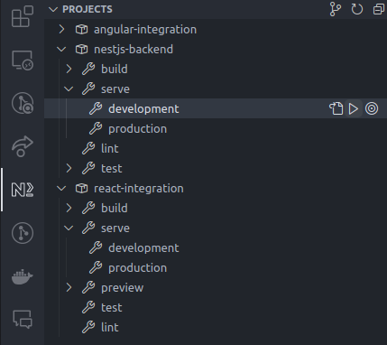
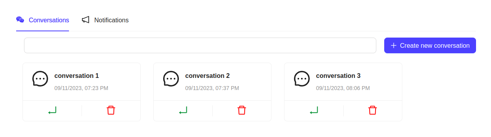
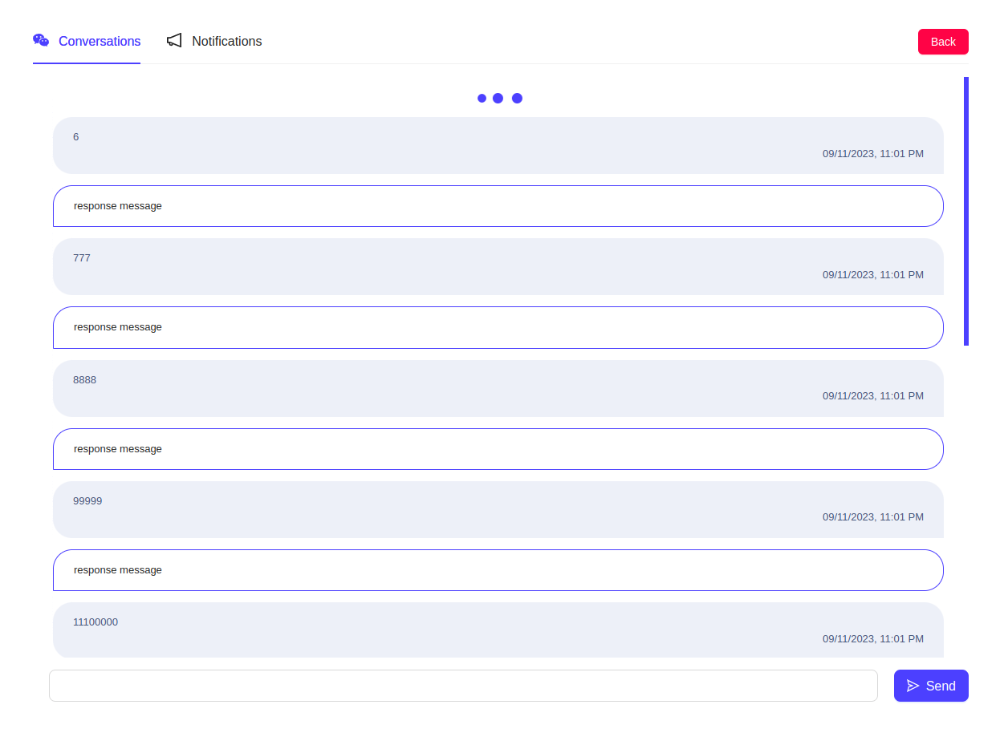
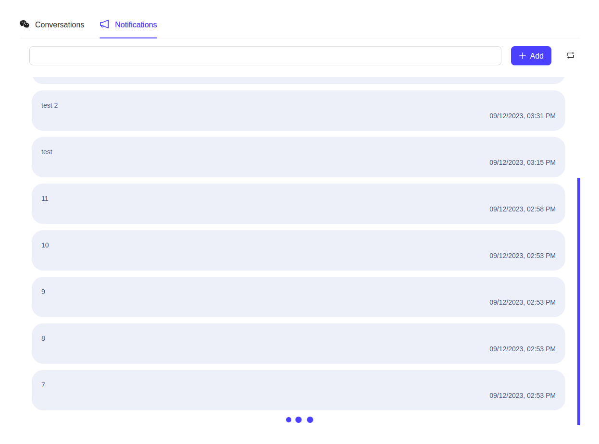

# Training - Infinite Scroll

This repository serves as a demonstration for the training session **[How to implement the infinite scroll efficiently](https://docs.google.com/presentation/d/1y8aMQqRAYMeBvLDhTLFM9XbROQZIfgQY/edit?usp=sharing&ouid=101655150170436898439&rtpof=true&sd=true)** It focuses on practical approaches for implementing infinite scroll, particularly when dealing with real-time data, REST APIs with pagination, and using the **Intersection Observer API** for the implementation.

## What's inside?

This workspace has been generated by **[Nx](https://nx.dev)** and it includes the following:

- [x] `nestjs-backend`
- [x] `react-integration`
- [ ] `angular-integration`

## Getting Started

- To get started, install all dependencies

```bash
npm install
```

- Then, prepare our local postgres database with docker

```bash
docker-compose up -d
```

- Next, run the TypeORM migrations to create the database schema

```bash
npm run migration:run
```

*After running the migrations, you can visit http://localhost:8080 and login to view your database*

- Finally, start the NestJS backend and React/Angular integration apps by running

```bash
npx nx run nestjs-backend:serve --configuration=development
```

```bash
npx nx run react-integration:serve --configuration=development
```

```bash
npx nx run angular-integration:serve --configuration=development
```

- Or by using the Nx Console Extension for VSCode as shown below



## Screenshots






